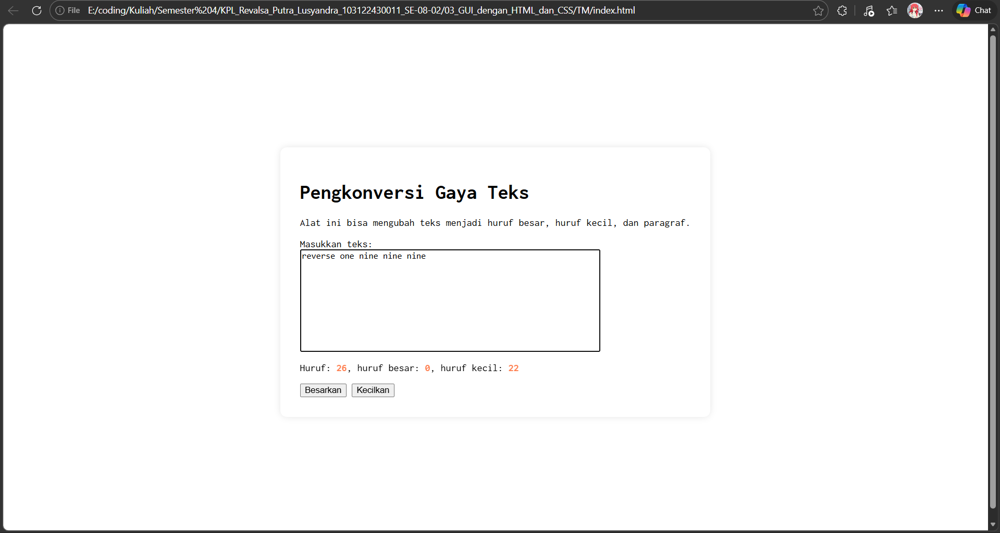
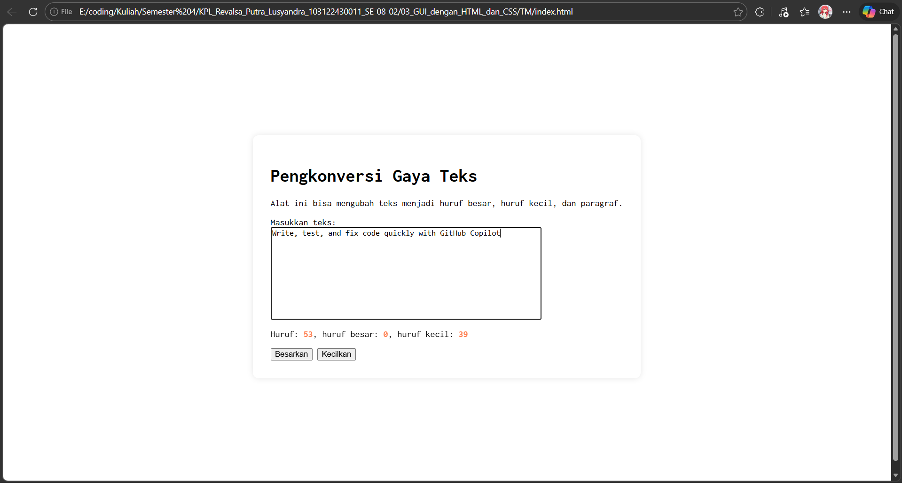
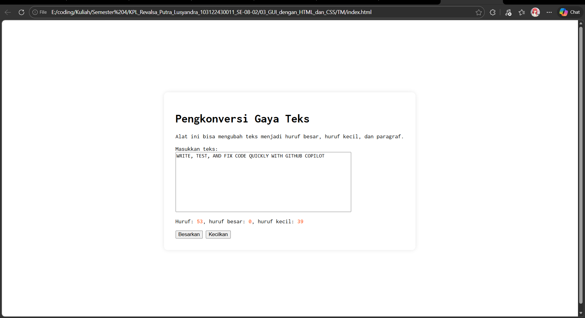

# TM 03_GUI_dengan_HTML_dan_CSS

`Revalsa Putra Lusyandra`

`103122430011`

`S1SE-08-02`

`Dosen pengampu: Yudha Islami Sulistiya`

`Asisten Praktikum: Adhiansyah Ancha & Hamid Khaeruman`

## Soal

Setelah kamu menyelesaikan tugas pendahuluan (bisa buka di atas), terapkanlah fungsi untuk (1) menghitung huruf kecil yang disediakan di #hk, (2) mengubah huruf kecil ke huruf besar ketika pengguna menekan tombol #huruf-besar, dan (3) mengubah huruf besar ke huruf kecil ketika pengguna menekan tombol #huruf-kecil. Untuk nomor 2 dan 3, tampilkan hasilnya di dalam editor-kecil. Kemudian, hapuslah fitur "Paragrafkan" dari alat.

## Kode Sumber

Ada di [index.html](./index.html) , [index.js](./index.js) dan , [index.css](./index.css)

## Output
  

## Deskripsi

Pada dokumen ini dilakukan beberapa perubahan pada alat pengolah teks yang sudah dibuat sebelumnya. yang pertama adalah menambahkan fungsi untuk menghitung jumlah huruf kecil dari teks yang diketik di `textarea`, lalu hasilnya ditampilkan pada bagian `#hk`. Lalu untuk tombol `#huruf-besar` digunakan untuk mengubah huruf kecil yang ada di teks menjadi huruf besar. Setelah tombol tersebut ditekan, hasil perubahannya langsung muncul kembali di `editor-kecil`. tombol `#huruf-kecil` juga ditambahkan fungsi untuk mengubah huruf besar menjadi huruf kecil. Pada tugas ini fitur Paragrafkan yang sebelumnya ada juga dihapus, sehingga ini hanya digunakan untuk menghitung huruf dan mengubah bentuk huruf besar maupun kecil.