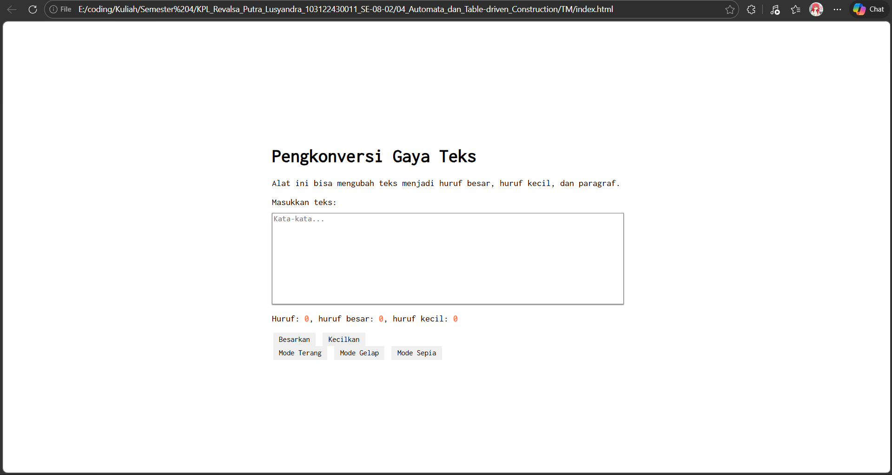
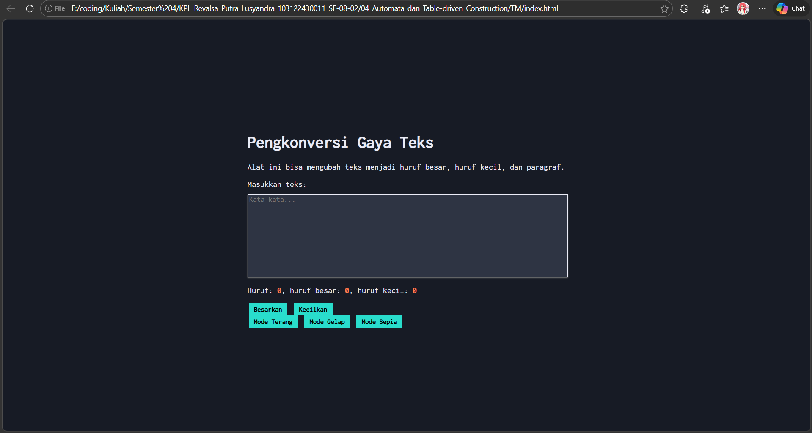
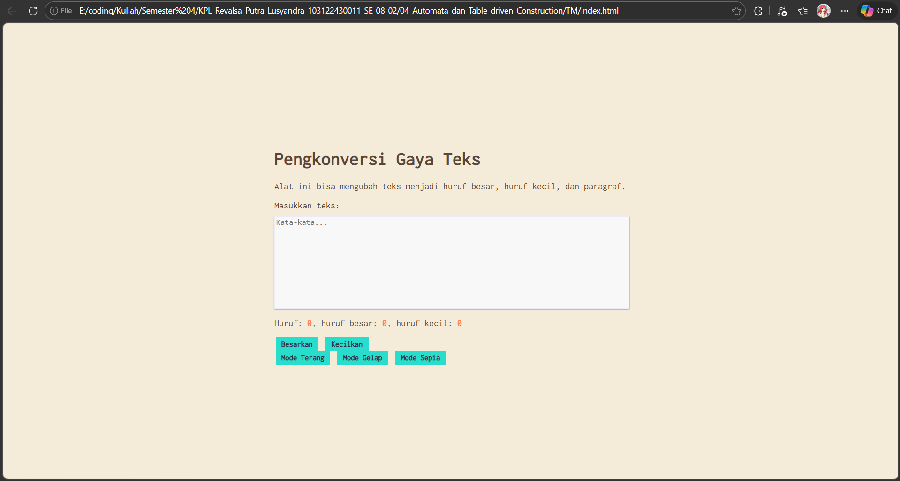

# TM 04_Automata_dan_Table-driven_Construction

`Revalsa Putra Lusyandra`

`103122430011`

`S1SE-08-02`

`Dosen pengampu: Yudha Islami Sulistiya`

`Asisten Praktikum: Adhiansyah Ancha & Hamid Khaeruman`

## Soal

Tambahkan mode sepia dengan ketentuan:

| **Elemen**     | **Warna** |
|----------------|-----------|
| Latar belakang | #F4ECD8 |
| Warna teks     | #5B4636 |

Biarkan form tetap warna putih.

Ketentuan lainnya:

1. Bagian `mode-div` harus menaungi tiga button: `light`, `dark`, dan `sepia`
2. Bisa berpindah state secara mulus: `sepia` menghasilkan `sepia-mode`, `dark` menghasilkan `dark-mode`, dan `light` menghasilkan `light-mode`

## Kode sumber
Tersedia di [index.html](index.html), [index.css](index.css), dan [index.js](index.js)

## Output
- **mode terang**

 

- **mode gelap**



- **mode sepia**



## Deskripsi Program
Di tm 4 ini, saya menambahkan button untuk tampilan baru yaitu mode sepia, dan menjadikannya menjadi satu div. Sebelumnya hanya ada mode terang dan gelap, dan untuk penambahan adalah mode sepia.

Saat tombol `Mode Sepia` diklik, tampilan halaman berubah menjadi warna sepia. Background menjadi warna `#F4ECD8`, lalu warna tulisannya menjadi `#5B4636`.

Di sini saya menambahkan beberapa code, dan untuk penjelasannya:

- Di file index.html, saya menambahkan tombol sepia dan menggabung/menyatukan button di dalam satu div yaitu `mode-div` :
```
<div class="mode-div">
    <button id="tombol-terang">Mode Terang</button>
    <button id="tombol-gelap">Mode Gelap</button>
    <button id="tombol-sepia">Mode Sepia</button>
</div>
```

- Di index.css, bagian ini untuk mengganti menjadi mode sepia, lalu untuk semua elemen ikut berubah warnanya, kecuali editor yang tetap terang :
```
.mode-sepia body {
    background-color: #f4ecd8;
    color: #5b4636;
}

.mode-sepia .container {
    background-color: #f4ecd8;
}

.mode-sepia .kotak-input {
    background-color: #f8f8f8;
    color: #5b4636;
    border: 1px solid #ebecf7;
}

.mode-sepia button {
    background-color: #29ddcc;
    color: #2e3443;
    font-weight: bold;
    border: none;
}
```

- Di index.js, saya menambah code agar bisa ganti ke mode sepia dan mode lainnya :
```
buttonLightElement.addEventListener("click", () => {
    document.documentElement.classList.remove("mode-gelap");
    document.documentElement.classList.remove("mode-sepia");
});

buttonDarkElement.addEventListener("click", () => {
    document.documentElement.classList.remove("mode-sepia");
    document.documentElement.classList.add("mode-gelap");
});

buttonSepiaElement.addEventListener("click", () => {
    document.documentElement.classList.remove("mode-gelap");
    document.documentElement.classList.add("mode-sepia");
});
```