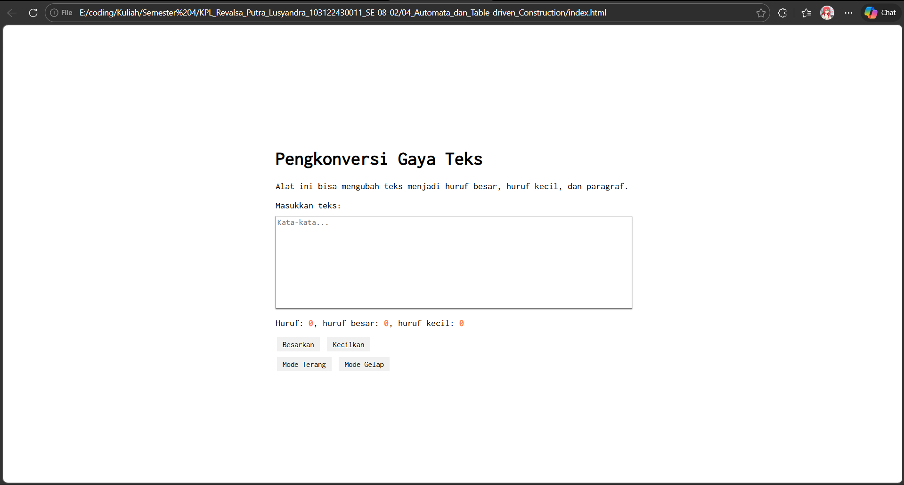
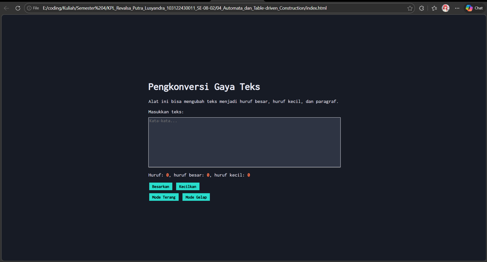

# TM 04_Automata_dan_Table-driven_Construction

`Revalsa Putra Lusyandra`

`103122430011`

`S1SE-08-02`

`Dosen pengampu: Yudha Islami Sulistiya`

`Asisten Praktikum: Adhiansyah Ancha & Hamid Khaeruman`

## Soal

Tambahkan mode gelap sekaligus untuk editor-kecil dan tombol-tombolnya. Ketentuan warna untuk latar belakang editor-kecil adalah #2e3443, sementara untuk tombol adalah #29ddcc. Teks untuk tombol tetap mengikuti warna teks sebelumnya.

Untuk menghapus pinggiran tombol, nyatakan properti `border` untuk tidak ditunjukkan.

## Kode Sumber

Ada di [index.html](./index.html) , [index.js](./index.js) dan , [index.css](./index.css)

## Output
 

## Deskripsi

Pada Dokumen ini, saya menambahkan fitur mode terang dan mode gelap pada page sesuai dengan soal. Fitur ini untuk mengganti tampilan dark atau light mode.

Ketika button Mode Gelap ditekan, tampilan page akan berubah menjadi lebih gelap. Perubahannya juga termasuk background page, kotak input teks, serta button yang ada. Sebaliknya, jika button Mode Terang ditekan, tampilan akan kembali seperti semula.

Untuk mengimplementasikannya, saya menambahkan :
```
<button id="tombol-terang">Mode Terang</button>
<button id="tombol-gelap">Mode Gelap</button>
```
Pada bagian HTML di atas, saya menambahkan dua button untuk mode terang ataupun mode gelap

```
.mode-gelap {
    background-color: #171b25;
    color: #ebecf7;
}

.mode-gelap .kotak-input {
    background-color: #2e3443;
    color: #ebecf7;
    border: 1px solid #ebecf7;
}

.mode-gelap button {
    background-color: #29ddcc;
    font-weight: bold;
    border: none;
}

.mode-gelap .container {
    background-color: #171b25;
}
```
Pada bagian CSS di atas, saya menggunakan class `.mode-gelap` untuk tampilan saat mode gelap. Warna background editor diubah menjadi `#2e3443`, sedangkan button diubah menjadi `#29ddcc` sesuai dengan ketentuan soal. Properti `border: none;` juga ditambahkan agar pinggiran button tidak ditampilkan.

```
buttonDarkElement.addEventListener("click", () => {
    document.documentElement.classList.add("mode-gelap");
});
```
Code di atas digunakan untuk mengaktifkan mode gelap. Ketika button ditekan, class `mode-gelap` akan ditambahkan ke elemen utama sehingga seluruh aturan CSS yang terkait akan diterapkan.

```
buttonLightElement.addEventListener("click", () => {
    document.documentElement.classList.remove("mode-gelap");
});
```
Nah kalau code di atas ini berfungsi untuk menonaktifkan mode gelap. Dengan menghapus kelas `mode-gelap`, tampilan halaman akan kembali ke mode terang.