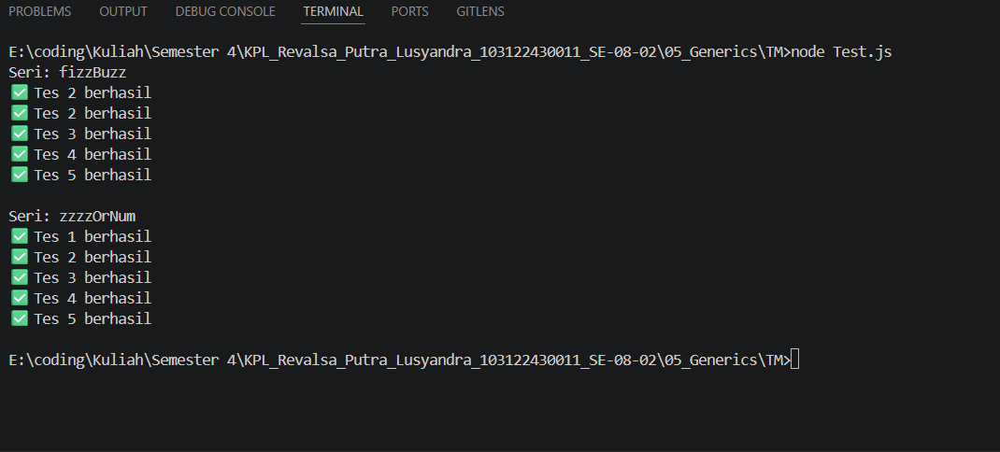

# TM 05_Generics

`Revalsa Putra Lusyandra`

`103122430011`

`S1SE-08-02`

`Dosen pengampu: Yudha Islami Sulistiya`

`Asisten Praktikum: Adhiansyah Ancha & Hamid Khaeruman`

## Soal

Diberikan program index.js

Aturan FizzBuzz kali ini adalah:
1. Fungsi `fizzBuzz` hanya menerima larik yang semua elemennya terdiri dari bilangan bulat dan mengeluarkan larik pula yang bisa jadi bercampur string dan bilangan
2. Fungsi `zzzzOrNum` hanya menerima sebuah data tunggal berupa bilangan bulat dan mengembalikan "Fizz", "FizzBuzz", "Buzz", atau bilanga bulat sesuai logikanya
3. Kedua fungsi harus ada dan harus disertai JSDoc sesuai tipe data yang disiratkan dari no. 1, no. 2, dan perilaku yang diharapkan di bawah
4. `fizzBuzz` harus menggunakan fungsi `zzzzOrNum` di dalamnya

## Kode Sumber

Ada di [index.js](./index.js) , [test.js](./test.js)

## Output

## Deskripsi
Di program ini saya melengkapi dua fungsi yang ada di file `index.js`, yaitu `zzzzOrNum` dan `fizzBuzz`, agar sesuai dengan aturan `FizzBuzz` yang diminta di soal.

yang pertama saya mengisi fungsi `zzzzOrNum` untuk mengecek satu angka saja. Di dalam fungsi ini, saya tambahkan pengecekan terlebih dahulu untuk memastikan input yang diberikan benar-benar berupa number. Kalau bukan, maka akan muncul error.

Setelah itu, fungsi akan mengecek kondisi `FizzBuzz` seperti biasa. Jika angka habis dibagi 15 akan menghasilkan `"FizzBuzz"`, jika habis dibagi 3 menghasilkan `"Fizz"`, dan jika habis dibagi 5 menghasilkan `"Buzz"`. Kalau tidak memenuhi semua kondisi tersebut, maka angka akan dikembalikan seperti semula.

Selanjutnya di fungsi `fizzBuzz` untuk memproses data dalam bentuk array. Sama seperti sebelumnya, saya tambahkan validasi agar input harus berupa array. Setelah itu, setiap elemen dalam array diproses menggunakan map, di mana tiap angka akan dikirim ke fungsi `zzzzOrNum`.

dan nanti outputnya akan seperti di gambar screenshot saya, lalu untuk test.js juga ada sedikit perbaikan dari templatenya, karena harusnya `const fb = require("./index.js")` bukan `const fb = require("./fizz.js");`