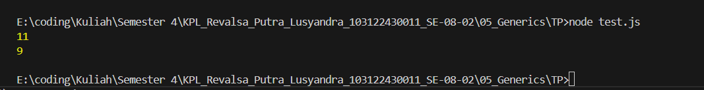

# TP 05_Generics

`Revalsa Putra Lusyandra`

`103122430011`

`S1SE-08-02`

`Dosen pengampu: Yudha Islami Sulistiya`

`Asisten Praktikum: Adhiansyah Ancha & Hamid Khaeruman`

## Soal
Ini adalah kode yang mengurus jumlah semua karakter dan jumlah huruf:
```
const str = "Bar bar";

let jumlahSemua = 0;
for (const c of str) { 
    jumlahSemua++; 
}
console.log(total);

let jumlahHuruf = 0;
for (const c of str) { 
    if (c === ' ') continue;
    jumlahHuruf++;
}
console.log(letters);
```
Bagaimana caramu hanya dengan satu fungsi generik bisa mengurus keduanya?

Agar fungsi yang kamu kerjakan benar atau tidak, berikut ini adalah kode tes yang bisa kamu tempelkan:
```
const str = "Bar bar bar";
...
console.log(
   hitung(str, "semua") // Harusnya 11
);

console.log(
  hitung(str, "huruf") // Harusnya 9
);

hitung(str, "huruf"); // Tidak terjadi apa-apa
```

## Kode Sumber

Ada di [index.js](./index.js) , [test.js](./test.js)

## output


## Deskripsi
Di program ini saya membuat fungsi `hitung` di file `index.js`, untuk menangani dua kondisi sekaligus, yaitu menghitung semua karakter dan menghitung hanya huruf. Cara kerjanya tetap sama, yaitu membaca setiap karakter dalam string satu per satu, namun di sini saya menambahkan parameter `tipe` sebagai penentu cara menghitungnya (untuk menghitung `str = "bar bar bar"`).

Untuk tipe diisi `"semua"`, jadi semua karakter termasuk spasi ikut dihitung. Sedangkan kalau tipe diisi `"huruf"`, maka spasi akan dilewati jadi yang dihitung hanya karakter selain spasi.

Setelah itu saya menambahkan `module.exports` supaya function ini bisa dipakai di file lain/ di `test.js`. Lalu di `test.js` function tersebut saya impor menggunakan `require`.

Lalu agar hasilnya 11 dan 9, untuk `const str = "Bar bar";` ditambah 1 huruf `"bar"` lagi, menjadi `const str = "Bar bar bar";`. jadi output akan 11 dan 9 sesuai dengan screenshot output saya dan ketentuan soal.

Kurang lebihnya seperti itu...