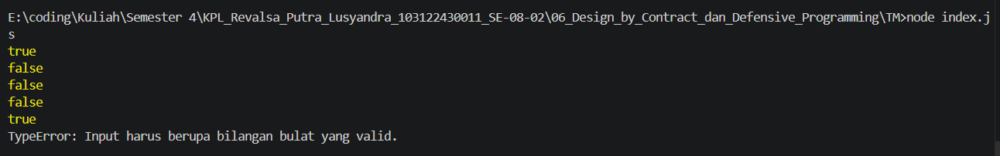

# TM 06_Design_by_Contract_dan_Defensive_Programming

`Revalsa Putra Lusyandra`

`103122430011`

`S1SE-08-02`

`Dosen pengampu: Yudha Islami Sulistiya`

`Asisten Praktikum: Adhiansyah Ancha & Hamid Khaeruman`

## Soal
Lindungi kode ini dari bilangan-bilangan "fizz buzz"!

Tugasmu adalah membuat fungsi yang menolak bilangan-bilangan kelipatan 3, 5, atau 15, menerima bilangan-bilangan bukan "fizz buzz", dan melempar yang bukan bilangan bulat.
```
function is_not_fizzbuzz(number) {
  // TODO
}

console.log(is_not_fizzbuzz(1)) // true
console.log(is_not_fizzbuzz(3)) // false
console.log(is_not_fizzbuzz(5)) // false
console.log(is_not_fizzbuzz(30)) // false
console.log(is_not_fizzbuzz(7)) // true
console.log(is_not_fizzbuzz(null)) // Lempar TypeError
console.log(is_not_fizzbuzz(NaN)) // Lempar TypeError
console.log(is_not_fizzbuzz(Infinity)) // Lempar TypeError
```

## Kode Sumber

Ada di [index.js](./index.js)

## Output


## Deskripsi Program
Jadi di sini saya membuat function untuk memeriksa apakah angka tersebut termasuk `"FizzBuzz"` atau bukan :

```
function is_not_fizzbuzz(number) {
  if (typeof number !== 'number' || !Number.isFinite(number)) {
    throw new TypeError('Input harus berupa bilangan bulat yang valid.');
  }

  if (number % 3 === 0 || number % 5 === 0) {
    return false;
  }

  return true;
}
```
di function atas, saya menerapkan input validation untuk memastikan bahwa argumen yang masuk benar-benar bertipe data number. di sini saya menggunakan `Number.isFinite` untuk memvalidasi argumen agar tetap berada dalam tipe data numerik namun mengecualikan nilai-nilai yang infinity atau tidak terdefinisi yang tidak bisa diproses, seperti `NaN` atau `Infinity`, kalau ada `NaN` Atau `Infinity` maka program akan dihentikan dan melempar TypeError.

Setelah memastikan input tersebut aman, lanjut ke tahap evaluasi logika menggunakan operator modulo. Di sini saya membuat function untuk mengetahui apakah angka tersebut ada sisa bagi nol saat bertemu dengan angka 3 atau 5. Jika iya, maka kondisinya terpenuhi dan akan return nilai false.

Nah jika semua pengecekkan itu sudah dilewati, akan return nilai true.