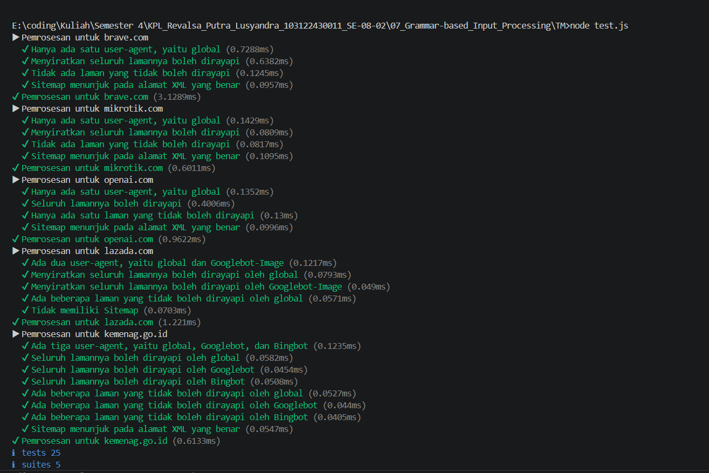
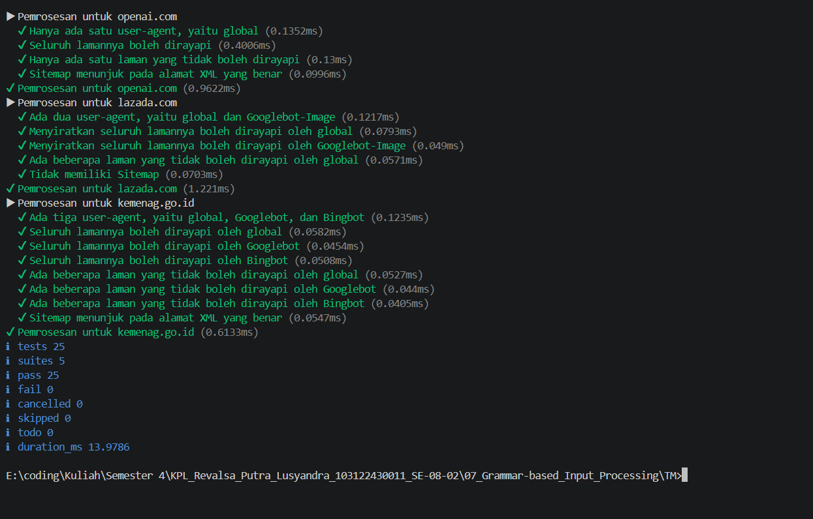

# TM 07_Grammar-based_Input_Processing

`Revalsa Putra Lusyandra`

`103122430011`

`S1SE-08-02`

`Dosen pengampu: Yudha Islami Sulistiya`

`Asisten Praktikum: Adhiansyah Ancha & Hamid Khaeruman`

## Soal
Tugas pada kesempatan kali ini adalah membuat fungsi yang menguraikan isi robots.txt menjadi POJO (plain old JavaScript object). Empat properti yang perlu diuraikan dijabarkan di bawah berikut.

1. User-agent adalah nama robot perayapnya
2. Allow adalah daftar halaman-halaman yang boleh dirayap
3. Disallow adalah daftar halaman-halaman yang tidak boleh dirayap
4. Sitemap adalah sebuah pranala yang menunjuk pada "denah" situs web (biasanya berformat XML)

## Kode Sumber

Ada di [index.js](./index.js)

## Output

## Deskripsi
Function yang saya buat di [index.js](./index.js) ini bertujuan untuk membaca isi `robots.txt` per baris, lalu mengubahnya menjadi object yang lebih terstruktur dan mudah digunakan. Di awal, saya pecah teks menjadi array baris menggunakan `split('\n')`, lalu menyiapkan object hasil dengan properti `agents` dan `Sitemap`, serta membuat variabel `currentAgents` untuk menyimpan `user-agent` yang sedang aktif saat parsing berlangsung.

Setelah itu dilakukan perulangan untuk membaca setiap baris. Di sini saya gunakan trim() supaya spasi tidak mengganggu proses parsing. Jika baris kosong atau berupa komentar `(diawali #)`, maka saya anggap blok sebelumnya sudah selesai, sehingga `currentAgents` di-reset agar tidak terbawa ke aturan berikutnya.

Selanjutnya saya memisahkan bagian key dan value dengan `split(':')`, karena format `robots.txt` memang seperti `User-agent: *`. Key saya ubah ke lowercase supaya lebih konsisten dan tidak sensitif terhadap perbedaan huruf besar/kecil.

Ketika menemukan `User-agent`, saya simpan nilainya ke dalam `currentAgents`. Jika agent tersebut belum ada di object hasil, maka saya inisialisasi dengan struktur `Allow` dan `Disallow` berupa array kosong. Jadi setiap agent punya tempat sendiri untuk menyimpan aturan.

Untuk bagian `Allow` dan `Disallow`, saya menambahkan path ke semua agent yang sedang aktif di `currentAgents`. Saya juga memastikan value tidak kosong supaya tidak ada data yang tidak valid masuk ke dalam array.

Sedangkan untuk `Sitemap`, karena sifatnya global (tidak tergantung user-agent), saya langsung masukkan ke dalam array Sitemap di object hasil. Hal yang sama juga saya lakukan untuk Host, tapi disimpan sebagai properti tunggal karena biasanya hanya satu nilai.

Jadi secara keseluruhan, function ini bekerja mirip konsep sederhana state machine, di mana `currentAgents` menjadi state yang aktif. Setiap kali ada `User-agent`, state berubah, dan aturan seperti `Allow` atau `Disallow` akan mengikuti state tersebut sampai ada perubahan atau reset.