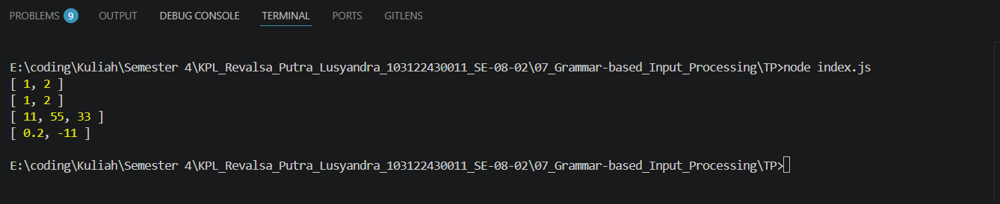

# TP 07_Grammar-based_Input_Processing

`Revalsa Putra Lusyandra`

`103122430011`

`S1SE-08-02`

`Dosen pengampu: Yudha Islami Sulistiya`

`Asisten Praktikum: Adhiansyah Ancha & Hamid Khaeruman`

## Soal
Buatlah fungsi yang mengubah deretan angka bertipe string menjadi larik angka.

```
function toNumberArray(number) {
  // TODO
}

console.log(toNumberArray("1, 2")) // [1, 2]
console.log(toNumberArray(["1", "2"])) // [1, 2]
console.log(toNumberArray(" 11,55,33   ")) // [11, 55, 33]
console.log(toNumberArray(["0.2", "-11", "abc23"])) // [0.2, -11]
```
## Kode Sumber

Ada di [index.js](./index.js)

## Output


## Deskripsi Program
Function yang saya buat untuk mengubah data dari string atau array string menjadi array berisi number. Di awal function, ada pengecekan menggunakan "if" untuk menentukan tipe input. Kalau input berupa string, maka akan dijalankan kode `input.split(",")` untuk memecah string berdasarkan koma. Misalnya `"1, 2"` menjadi `["1", " 2"]`. Kalau input sudah berupa array, maka langsung digunakan tanpa perlu diubah lagi. Kalau bukan keduanya, function langsung mengembalikan `[]`. codenya :

```
if (typeof input === "string") {
  arr = input.split(",");
} else if (Array.isArray(input)) {
  arr = input;
} else {
  return [];
}
```

Setelah itu mengubah setiap elemen menjadi number. Di sini digunakan `map()` untuk memproses setiap item dalam array. Di dalamnya ada `item.trim()` untuk menghapus spasi yang tidak perlu, lalu `parseFloat()` untuk mengubah string menjadi angka. Misalnya `" 2"` akan menjadi `2`, dan `"0.2"` akan menjadi `0.2`. codenya :

```
arr.map(item => parseFloat(item.trim()))
```

Namun tidak semua string bisa diubah menjadi angka yang valid. Contohnya `"abc23"` akan menghasilkan `NaN`. Jadi ditambahkan `filter()` dengan kondisi `!isNaN(num)` untuk menyaring hasil yang valid saja. Jika `isNaN(num)` bernilai true, artinya itu bukan angka dan akan dibuang. Sebaliknya, kalau false, berarti angka valid dan akan tetap disimpan. codenya :

```
.filter(num => !isNaN(num))
```

`map()` dan `filter()` ini memastikan bahwa semua elemen yang masuk ke hasil akhir sudah benar-benar berupa number. Jadi meskipun input bercampur antara angka valid dan tidak valid, output tetap bersih dan hanya berisi angka saja, sesuai dengan tujuan function ini.