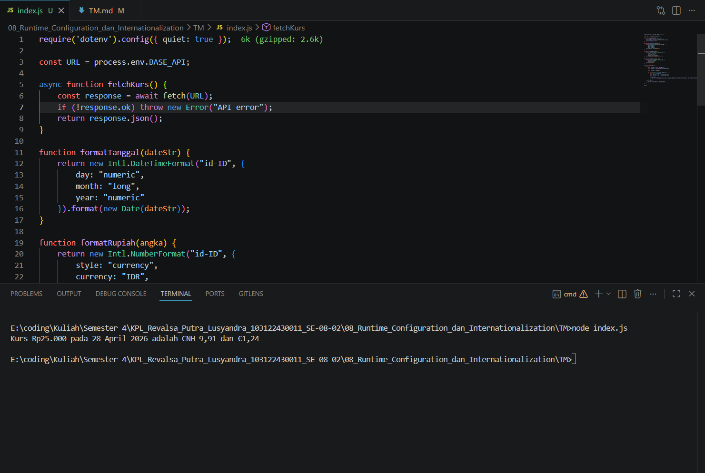

# TM 08_Runtime_Configuration_dan_Internationalization

`Revalsa Putra Lusyandra`

`103122430011`

`S1SE-08-02`

`Dosen pengampu: Yudha Islami Sulistiya`

`Asisten Praktikum: Adhiansyah Ancha & Hamid Khaeruman`

## Soal
Waktunya menukar uang!

Pada tugas ini kamu akan membuat program yang menampilkan kurs rupiah (IDR) terhadap renminbi luar Tiongkok (CNH) dan euro (EUR). Gunakan link API ini untuk mengambil data.

Tantangan

1. Simpanlah URL API ke dalam .env sebagai BASE_API

2. Gunakan Intl untuk memformat nilai mata uang dan waktu kamu mengambil data kurs.

3. Hapus pesan promosi dotenv

## Kode Sumber

Ada di [index.js](./index.js)

## Output

## Deskripsi Program
Di index.js, saya membuat code untuk mengambil data kurs dari API yang URLnya disimpan di file .env sebagai BASE_API, lalu untuk hapus pesan promosi dari dotenv, saya menggunakan `require('dotenv').config({ quiet: true })` supaya output tidak ada pesan promosi `dotenv`.

Selanjutnya, saya membuat function `fetchKurs()` untuk mengambil data kurs IDR terhadap CNH dan EUR dari API menggunakan fetch. Data yang didapat juga sudah termasuk tanggal, jadi di sini saya tidak pakai waktu lokal, tapi langsung dari API agar hasilnya akurat. Setelah itu, saya menggunakan Intl di beberapa function seperti `formatTanggal()`, `formatRupiah()`, dan `formatValuta()` untuk memastikan format tanggal dan mata uang sesuai standar.