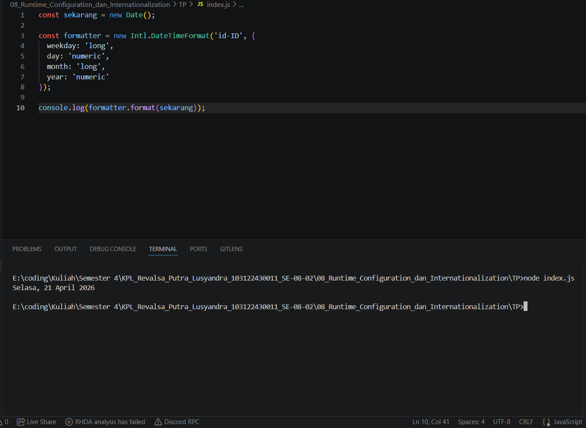

# TP 08_Runtime_Configuration_dan_Internationalization

`Revalsa Putra Lusyandra`

`103122430011`

`S1SE-08-02`

`Dosen pengampu: Yudha Islami Sulistiya`

`Asisten Praktikum: Adhiansyah Ancha & Hamid Khaeruman`

## Soal
Tampilkan tanggal sekarang dengan format seperti ini:

`Sabtu, 18 April 2026`

Nilai waktu tidak harus sama, asalkan formatnya benar dan bisa tampil di komputer terpisah pada waktu tertentu. Gunakan Intl.DateTimeFormat (bukan string manual).

## Kode Sumber

Ada di [index.js](./index.js)

## Output

## Deskripsi Program
Di sini saya menggunakan `new Date()` untuk mengambil waktu saat ini secara otomatis dari sistem, jadi tanggalnya tidak ditulis manual dan bisa berubah sesuai waktu saat ini. Lalu saya buat formatter dengan `Intl.DateTimeFormat` menggunakan locale `'id-ID'` supaya formatnya menggunakan bahasa Indonesia. Setelah itu saya tinggal memformat tanggal menggunakan formatter tersebut, jadi hasilnya sesuai soal yaitu `“Sabtu, 18 April 2026”`.