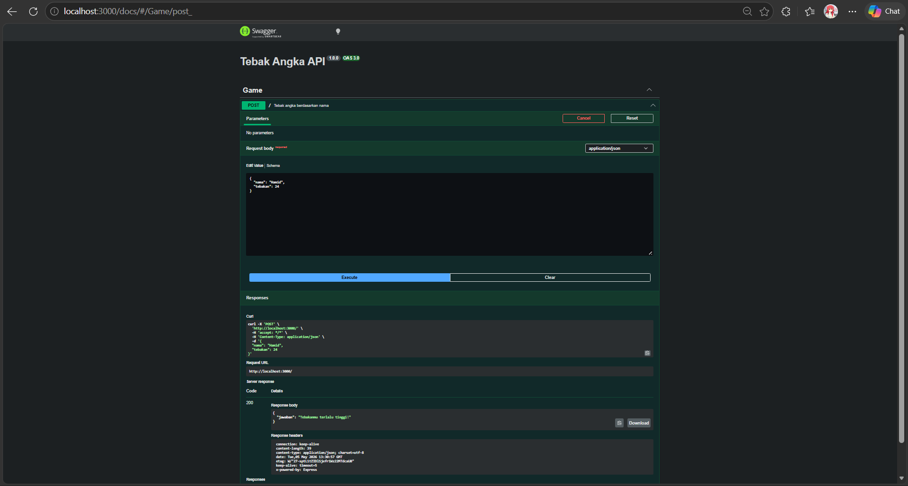
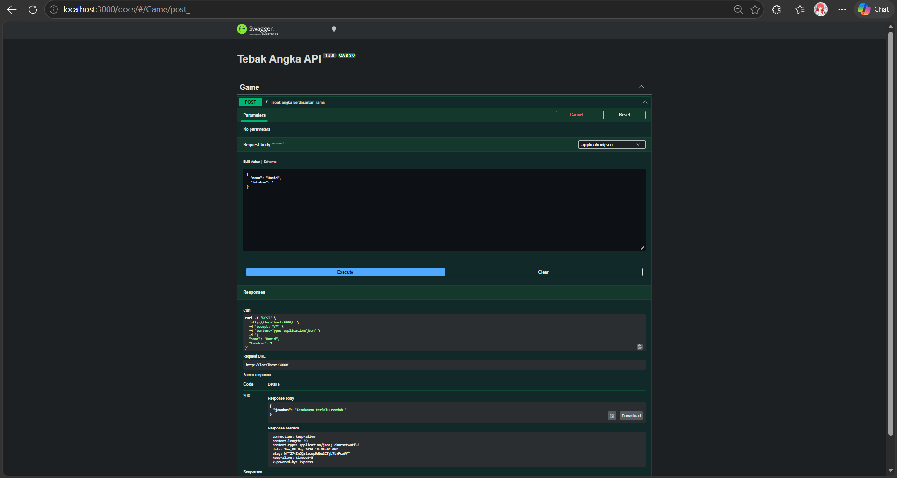
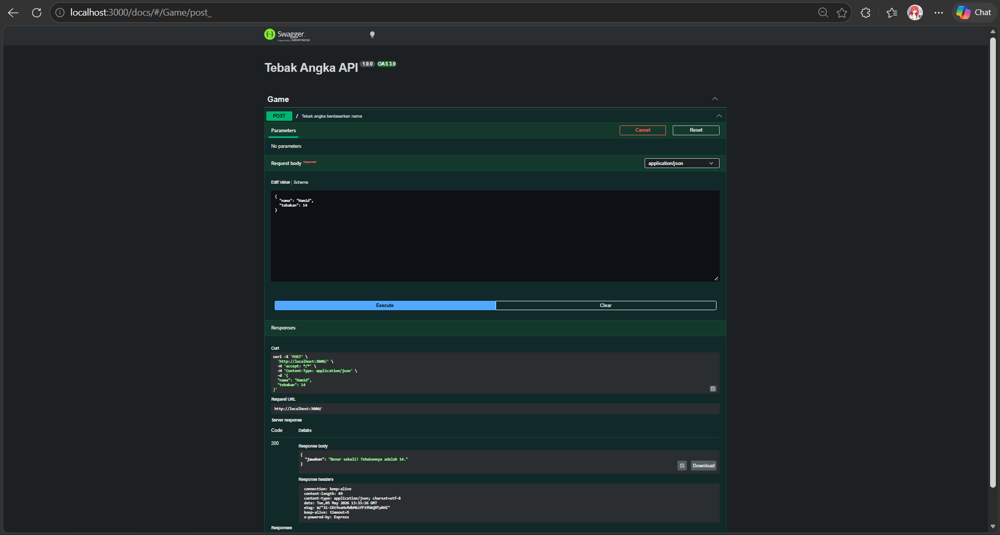

# TM 09_API_Design_dan_Construction_Using_Swagger

`Revalsa Putra Lusyandra`

`103122430011`

`S1SE-08-02`

`Dosen pengampu: Yudha Islami Sulistiya`

`Asisten Praktikum: Adhiansyah Ancha & Hamid Khaeruman`

## Soal
Mari kita main tebak-tebakan angka acak!

Tugasmu adalah membuat API yang terdiri dari satu endpoint saja, yaitu POST /. Ketika kita melakkukan POST, formatnya adalah seperti di bawah ini.
```
{
  "nama": "Hamid",
  "tebakan": 24
}
```
Jika tebakan benar.
```
{
    "jawaban": "Benar sekali! Tebakannya adalah 24."
}
```
Jika tebakan terlalu tinggi.
```
{
    "jawaban": "Tebakanmu terlalu tinggi!"
}
```
Jika tebakan terlalu rendah.
```
{
    "jawaban": "Tebakanmu terlalu rendah!"
}
```
Beberapa aturan:

1. Angka acak yang dihasilkan harus tetap dan tidak boleh berubah setiap kali permintaan API dilakukan, tetapi boleh berubah setiap harinya atau dibuat tetap selamanya
2. Rentang harus di antara 1-100
3. Nama harus sensitif terhadap besar kecil huruf (mis. hamid dan Hamid akan menghasilkan angka acak yang berbeda)
4. Tidak menggunakan pustaka apapun, murni mengandalkan nama dan tebakan

Penjelasan untuk nomor 1: Jika namanya Hamid, ia akan diharapkan tetap pada nilai tebakan 24 mau kamu melakukan 100 kali permintaan. Tidak ada jawaban benar di sini (Hamid tidak harus 24, bebas mau dibuat acak seperti apa yang penting harus tetap).


## Kode Sumber

Ada di [index.js](./index.js)

## Output




## Deskripsi Program
API ini adalah game tebak angka sederhana yang punya 1 endpoint utama yaitu `POST /`. User kirim data nama dan tebakan dalam format JSON, lalu sistem bakal bikin angka rahasia dari nama tersebut di range 1 sampai 100.

Inti logikanya ada di function generator ini:
```
const generateNumberFromName = (name = "") =>
  (Array.from(name).reduce((acc, char, idx) =>
    acc + char.charCodeAt(0) * (idx + 1), 0) % 100) + 1;
```
Di sini nama diubah jadi array karakter, terus tiap huruf diubah ke ASCII pakai `charCodeAt`, lalu dikalikan posisinya `(idx + 1)`. Hasil totalnya di-modulo 100 supaya tetap masuk range 0–99, terus ditambah 1 biar jadi 1–100. Makanya nama yang sama bakal selalu ngasih angka yang sama.

Setelah itu di endpoint `POST /`, hasil dari function tadi dibandingkan sama tebakan:
```
router.post('/', (req, res) => {
  const { nama, tebakan } = req.body;
  const angkaRahasia = generateNumberFromName(nama);
```

Bagian ini ambil input user, terus generate angka rahasia dari nama. Setelah itu sistem cuma ngecek 3 kondisi: kalau sama berarti benar, kalau lebih besar berarti terlalu tinggi, kalau lebih kecil berarti terlalu rendah. Logikanya disederhanakan lewat mapping:
```
const result =
  responseMap.equal.condition
    ? responseMap.equal.message
    : responseMap.high.condition
      ? responseMap.high.message
      : responseMap.low.message;
```

Jadi alurnya kurang lebihnya: input lalu generate angka dari nama dan compare lalu kasih respon JSON.