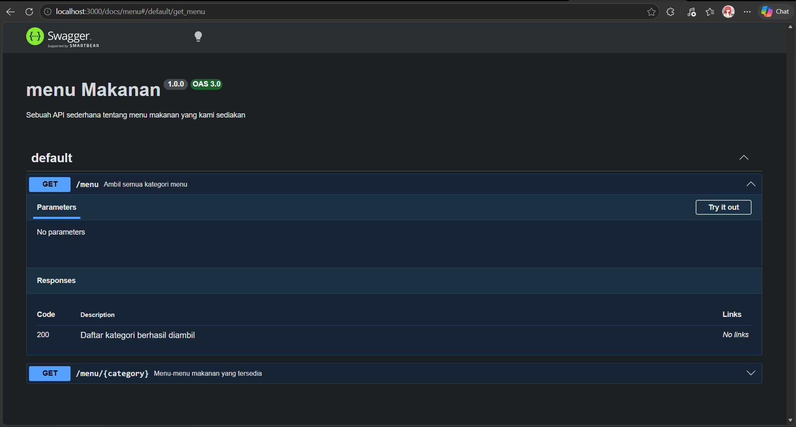
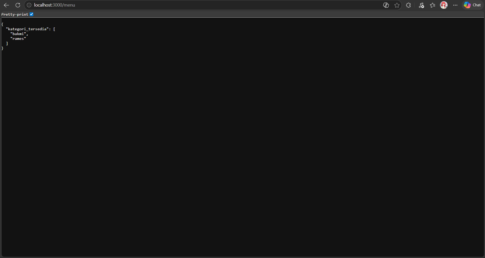

# TP 09_API_Design_dan_Construction_Using_Swagger

`Revalsa Putra Lusyandra`

`103122430011`

`S1SE-08-02`

`Dosen pengampu: Yudha Islami Sulistiya`

`Asisten Praktikum: Adhiansyah Ancha & Hamid Khaeruman`

## Soal


## Kode Sumber

Ada di [index.js](./index.js), [swagger.js](./swagger.js)

## Output



## Deskripsi Program
Di `index.js`, saya membuat API sederhana menggunakan Express, mengikuti petunjuk dan code dari asprak. Pertama, express diimport lalu dibuat instance app, dan server dijalankan di `port 3000`. di sini menghubungkan Swagger lewat swagger.js supaya dokumentasi API bisa diakses di endpoint `/docs`, jadi bisa dilihat dan coba API langsung melalui browser setelah server dijalankan.

Data menu disimpan di object `menuData`, yang berisi dua kategori utama yaitu bakmi dan rames, masing-masing punya daftar menu dan harga. Endpoint `/` hanya sebagai landing page sederhana yang memberi pesan `pesan": "Cek /docs untuk melihat rincian API"`.

Lalu ada endpoint utama `/menu/:category`. Di sini, `req.params.category` dipakai untuk mengambil kategori dari URL (misalnya `/menu/bakmi`). Program akan cek apakah kategori tersebut ada di menuData. Kalau ada, data menu dikembalikan dalam bentuk JSON. Kalau tidak ada, akan dikirim response `error 404` dengan pesan `“Menu tidak ditemukan”`. Endpoint ini juga sudah didokumentasikan pakai OpenAPI (Swagger), jadi ada penjelasan parameter, response, dan deskripsinya.

lalu Di endpoint ini :
```
/**
 * @swagger
 * /menu:
 *   get:
 *     summary: Menampilkan semua kategori menu
 *     responses:
 *       200:
 *         description: Daftar kategori berhasil ditampilkan
 */
app.get('/menu', (req, res) => {
    const categories = Object.keys(menuData);
    res.json(categories);
});
```
saya mengambil semua nama kategori dari menuData menggunakan `Object.keys()`. Hasilnya berupa array seperti `["bakmi", "rames"]`, lalu langsung dikirim sebagai response JSON. Swagger documentation juga ditambahkan supaya endpoint ini muncul di `/docs`, lengkap dengan deskripsi dan response-nya.