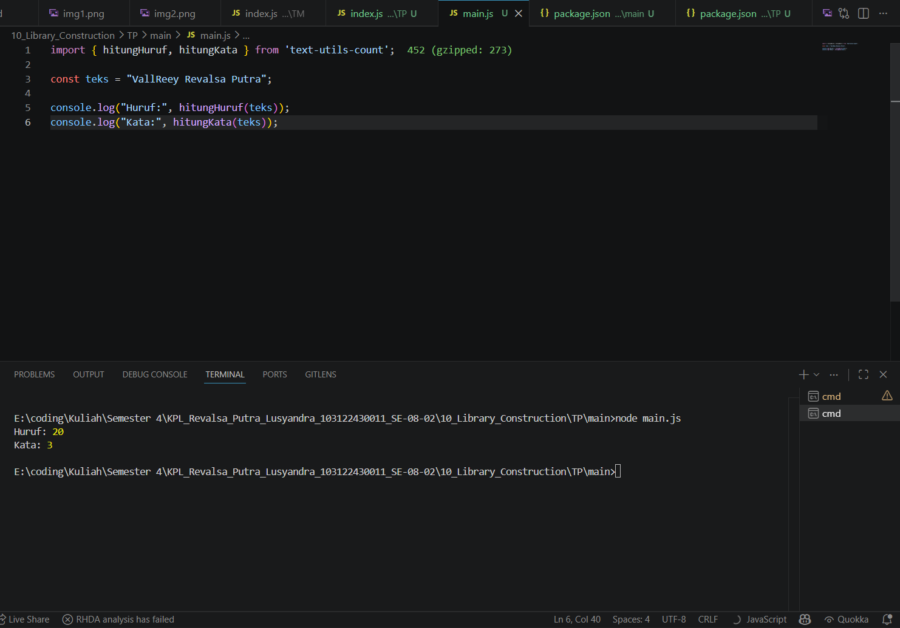

# TP 10_Library_Construction

`Revalsa Putra Lusyandra`

`103122430011`

`S1SE-08-02`

`Dosen pengampu: Yudha Islami Sulistiya`

`Asisten Praktikum: Adhiansyah Ancha & Hamid Khaeruman`

## Soal
Buatlah pustaka JavaScript yang menyediakan utilitas berupa dua fungsi yang menghitung jumlah huruf dan jumlah kata.

Kriteria:

1. Hanya alfabet A hingga Z yang dihitung (besar dan kecil)
2. Spasi tidak dihitung
3. Pustaka bisa diimpor

## Kode Sumber

Ada di [index.js](./index.js), [main.js](./main/main.js)

## Output

## Deskripsi Program
di program ini saya membuat sebuah library untuk mengolah teks. Library ini dibuat pada direktori terpisah, yaitu di dalam folder TP, sehingga tidak terhubung langsung dengan `main.js`. Setelah itu, saya melakukan inisialisasi proyek menggunakan `npm init -y` dan mengatur konfigurasi pada `package.json`, termasuk penentuan `type: "module"` dan file utama `index.js`.

Di dalam library tersebut, saya mengimplementasikan dua fungsi, yaitu `hitungHuruf` dan `hitungKata`. Fungsi `hitungHuruf` digunakan untuk menghitung jumlah huruf alfabet (A-Z) dalam sebuah teks, sedangkan fungsi `hitungKata` digunakan untuk menghitung jumlah kata yang hanya terdiri dari huruf. Kedua fungsi ini mengabaikan angka, spasi, dan simbol lainnya sesuai dengan kriteria yang ditentukan.

Selanjutnya, saya membuat `main.js` di dalam folder `TP/main`. Library yang telah sudah dibuat tadi kemudian diinstal ke dalam `main.js` tersebut menggunakan perintah npm install .., jadi library nanti bisa digunakan seperti package pada umumnya. Setelah itu, saya mengimpor fungsi dari library ke dalam file `main.js`.