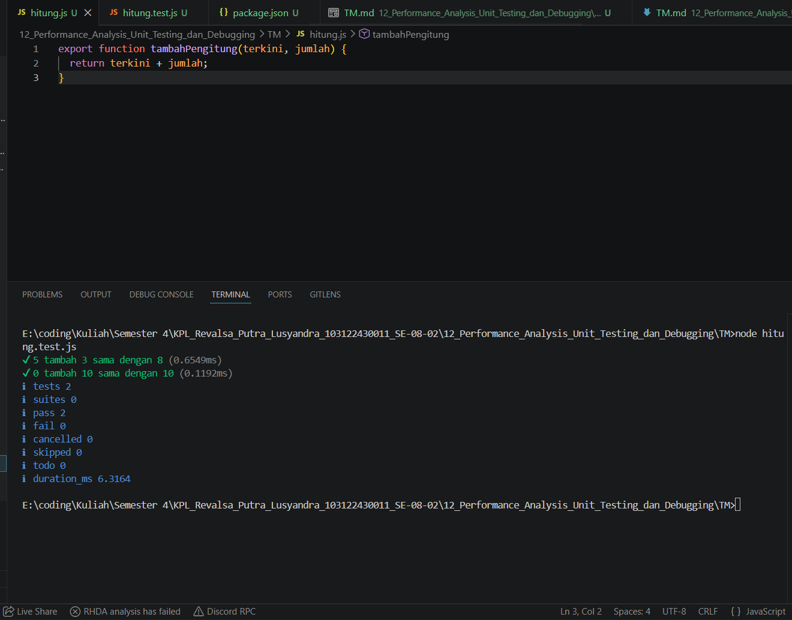

# TM 12_Performance_Analysis_Unit_Testing_dan_Debugging

`Revalsa Putra Lusyandra`

`103122430011`

`S1SE-08-02`

`Dosen pengampu: Yudha Islami Sulistiya`

`Asisten Praktikum: Adhiansyah Ancha & Hamid Khaeruman`

## Soal
Tambah dan tambah!

Fungsi di bawah ini melakukan penjumlaha pada penghitung (counter), yang sesederhana menambahk jumlah jika kamu menekan tombol.

`hitung.js`

```
function tambahPengitung(terkini, jumlah) {
  terkini = terkini + jumlah;
  return terkini;
}
```

`hitung.test.js`

```
import { test } from 'node:test';
import assert from 'node:assert';
import { tambahPengitung } from './hitung.js';

test('5 tambah 3 sama dengan 8', () => {
  assert.strictEqual(tambahPengitung(5, 3), 8);
});

test('0 tambah 10 sama dengan 10', () => {
  assert.strictEqual(tambahPengitung(0, 10), 10);
});
```

Bisakah kamu tunjukkan apakah kode sudah benar atau bagian mana yang perlu diperbaiki beserta alasannya?

## Kode Sumber

- [hitung.js](./hitung.js)
- [hitung.test.js](./hitung.test.js)

## Output


## Deskripsi Program
Rumus penjumlahannya sudah benar, tetapi fungsi harus diberi export agar bisa dipanggil di file test. Tanpa export, test akan error karena tambahPengitung tidak ditemukan sebagai module export. jadi di situ saya mengubah `hitung.js` menjadi export agar bisa dipanggil dan digunakan di `hitung.test.js`