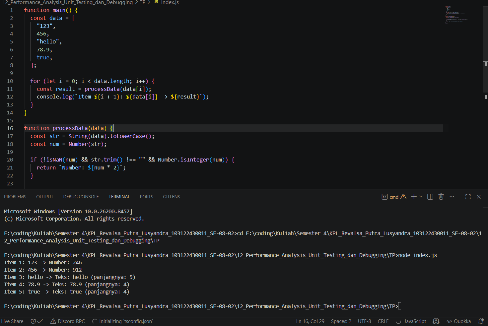

# TP 12_Performance_Analysis_Unit_Testing_dan_Debugging

`Revalsa Putra Lusyandra`

`103122430011`

`S1SE-08-02`

`Dosen pengampu: Yudha Islami Sulistiya`

`Asisten Praktikum: Adhiansyah Ancha & Hamid Khaeruman`

## Soal

Cobalah untuk menangkap kecacatan dalam kode ini
```
function main() {
  const data = [
    "123",
    456,
    "hello",
    78.9,
    true,
  ];

  for (let i = 0; i < data.length; i++) {
    const result = processData(data[i]);
    console.log(`Item ${i + 1}: ${data[i]} -> ${result}`);
  }
}

function processData(data) {
  const str = data.toLowerCase();
  const num = parseInt(str);
  if (!isNaN(num) && str === String(num)) {
    return `Number: ${num * 2}`;
  }
  return `Teks: ${str} (panjangnya: ${str.length})`;
}

main();
```

## Kode Sumber

Ada di [index.js](./index.js)

## Output


## Deskripsi Program
Kode awal error karena semua data langsung dianggap string, padahal ada data angka dan boolean. Jadi di sini data perlu diubah dulu menjadi string menggunakan `String(data)`, baru setelah itu bisa memakai `toLowerCase()`. Lalu di sini saya menambahkan `Number(str)` untuk pengecekannya agar data seperti `"123"` dan `456` bisa diproses sebagai angka. tapi kalau tanpa `Number(str)` juga masih normal saja, cukup ganti saja di kecacatan utamanya yaitu :

```
const str = data.toLowerCase();
```

Karena `toLowerCase()` hanya bisa dipakai pada string. Sementara isi array data ada yang berupa number dan boolean, Jadi program akan error ketika memproses 456.

menjadi :
```
const str = String(data).toLowerCase(); 
```